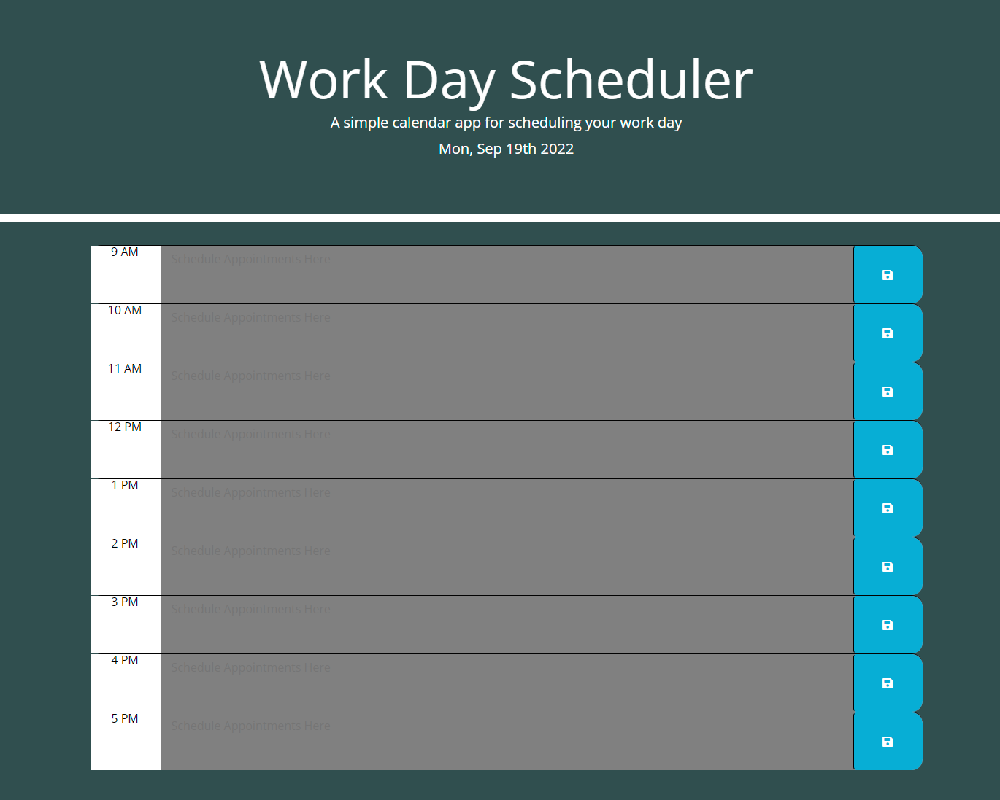

# Work Day Scheduler Starter Code
GIVEN I am using a daily planner to create a schedule
WHEN I open the planner
THEN the current day is displayed at the top of the calendar
WHEN I scroll down
THEN I am presented with time blocks for standard business hours
WHEN I view the time blocks for that day
THEN each time block is color-coded to indicate whether it is in the past, present, or future
WHEN I click into a time block
THEN I can enter an event
WHEN I click the save button for that time block
THEN the text for that event is saved in local storage
WHEN I refresh the page
THEN the saved events persist

----------------------------------------------------------------------------------------------

## Description

The purpose of this assignment was to create a functional daily planner using 3rd-Party APIs.
I utilized Bootstrap to format the page, JQuery to handle the JavaScript, and Moment in the
date and times.  This project gave me an invaluable introduction into 3rd-Party APIs.  Despite
the fact that the APIs used in this project are no longer supported, they are still common in
many websites, especially older ones.  In my career as a developer I will inevitably have to work
with them, in some cases to modernize and replace in others to support and maintain.  Furthermore,
there are many more modern 3rd-Party APIs which I will need to learn and use.  JQuery and the others we utilized in making this program have been around for many years and extensive support exists for them online.  Using them as an introductory point into dealing with 3rd-Party APIs is ideal.

In summary, I learned much on how to import and utilize 3rd-Party APIs, especially regarding usage of documentation to support what I may not be familiar with personally.  Getting into the habit of
referencing the documentation will help me to avoid becoming out of touch with the most current iteration of a program, 3rd-Party or otherwise.

## Usage

Visit the webage live online at: [https://golemancer-ctrl.github.io/wc-scheduler-05/].

## Credits

- W3Schools
- MDN Web Docs
- JQuery API Documentation
- Bootstrap API Documentation
- Moment API Documentation